# EcoSphere — ESG Management Platform

**Odoo Hackathon submission** · Environmental, Social & Governance performance in one executive dashboard — plus an **employee view**, **FastAPI backend**, and **ESG RAG** insight search.

Organizations must monitor carbon emissions, promote employee well-being, and maintain governance compliance. **EcoSphere** integrates ESG into day-to-day operations: executive dashboards for leadership, a dedicated **employee** experience at `/mobile`, typed & custom reports, digital twin facility monitoring, and an API + RAG layer for AI-assisted insights.

**Repo:** [github.com/Athina09/Odoo-Hackathon-](https://github.com/Athina09/Odoo-Hackathon-)

---

## Challenge statement

Build an ESG Management Platform that enables organizations to **measure**, **manage**, and **improve** Environmental, Social and Governance performance — integrating operational data, **employee participation**, compliance, and gamification.

| Pillar | Scope |
|--------|--------|
| **Environmental** | Carbon accounting, emission factors, sustainability goals |
| **Social** | CSR activities, employee participation, diversity |
| **Governance** | Policies, audits, compliance tracking |
| **Gamification** | Challenges, badges, XP, rewards, leaderboards |

**Design mockup:** [Excalidraw wireframe](https://link.excalidraw.com/l/65VNwvy7c4X/2m6lz9Ln4)

---

## Our solution

**EcoSphere** is our answer to that challenge: one platform where leadership monitors ESG KPIs, department managers act on scoped data, and employees participate through a **dedicated employee view** — without ERP training.

| Layer | What it does |
|-------|----------------|
| **Executive dashboards** | Command center, environment/social/governance modules, digital twin, typed & custom reports |
| **Employee view** (`/mobile`) | Challenges, CSR, leaderboard, personal impact, photo evidence submission |
| **FastAPI backend** | REST API mirroring ESG data, employee bootstrap, health checks |
| **AI layer** | **EcoSphere AI** assistant on every role, RAG search over ESG insights, AI confidence on digital twin zones |

We designed EcoSphere for real adoption: role-gated web views for admins and managers, a frictionless **employee** experience at `/mobile`, and **AI-assisted insights** so teams can ask questions, surface risks faster, and trust telemetry with confidence scores — not just static charts.

---

## App UI — screenshots

Real screens from the running app. Every role sees the **EcoSphere AI** button (bottom-right on web dashboards, above the tab bar on the employee view) plus **AI confidence** scores on dashboards, the digital twin, and employee impact screens.

### Web — leadership & managers

| Screen | What it shows |
|--------|----------------|
| **Login** | Role picker — Super Admin, ESG Manager, Dept Manager, Employee |
| **Command Center** | ESG KPIs, Tamil Nadu heatmap, **AI Live Insights** feed, department table |
| **Charts & AI** | ESG radar, carbon trend, health score, **AI recommendations** |
| **Digital Twin** | Live plant blueprint, zone telemetry, **AI model confidence** |
| **Social** | CSR participation, diversity index, contributor spotlight |
| **Gamification** | Season leaderboard, badges, active challenges |
| **Reports** | Typed reports + custom builder with PDF/Excel/CSV export |
| **Report preview** | Slide-over preview with KPIs and export actions |
| **Settings** | ESG weight sliders, auto-emission & badge rules |
| **Dept Manager** | Scoped manufacturing dashboard with **AI confidence** |

<p align="center">
  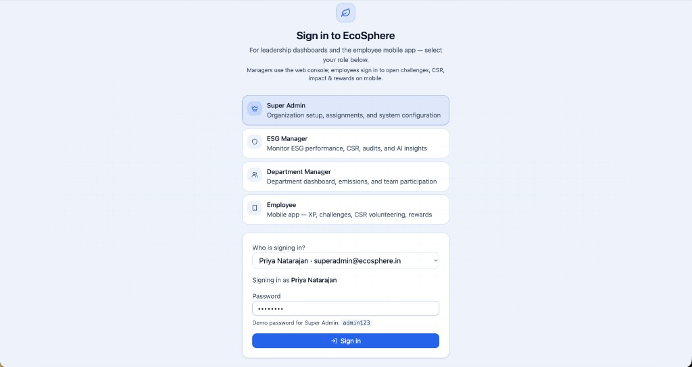
</p>
<p align="center"><em>Login — pick your role and sign in</em></p>

<p align="center">
  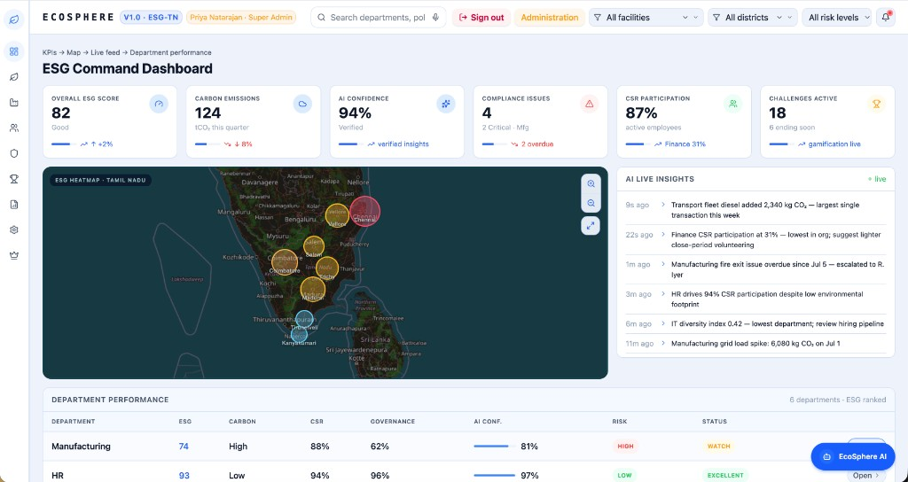
</p>
<p align="center"><em>Command Center — KPIs, heatmap, AI Live Insights, department performance</em></p>

<p align="center">
  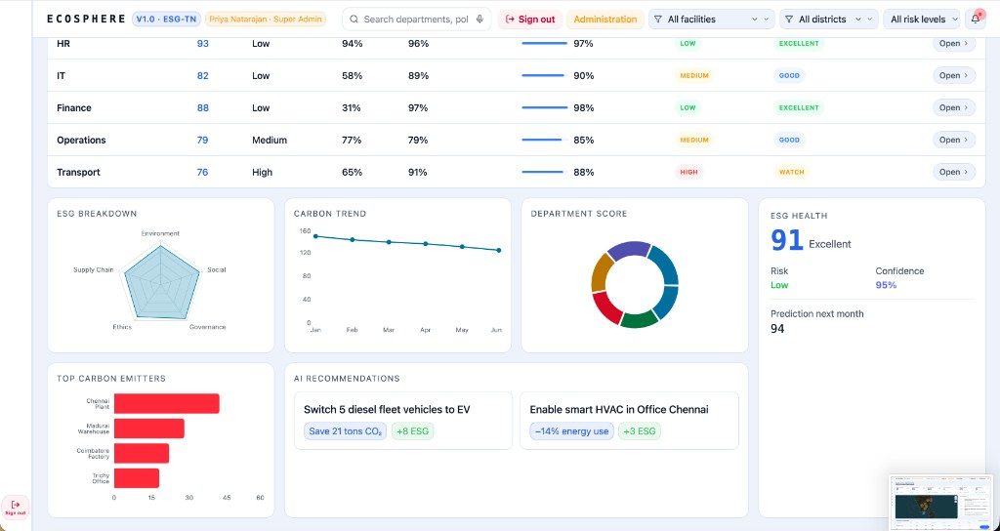
</p>
<p align="center"><em>Charts — ESG breakdown, carbon trend, AI recommendations</em></p>

<p align="center">
  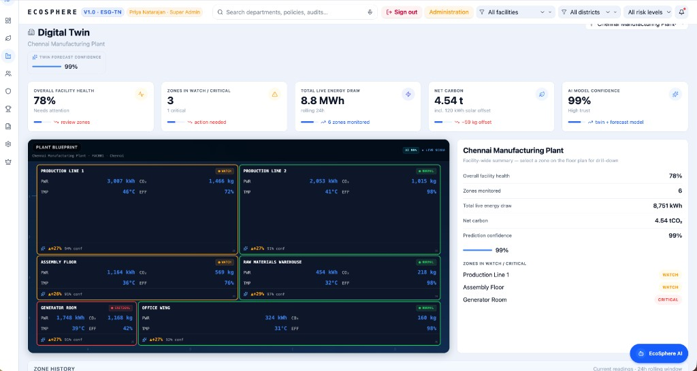
</p>
<p align="center"><em>Digital Twin — live zones, energy/CO₂ telemetry, AI model confidence</em></p>

<p align="center">
  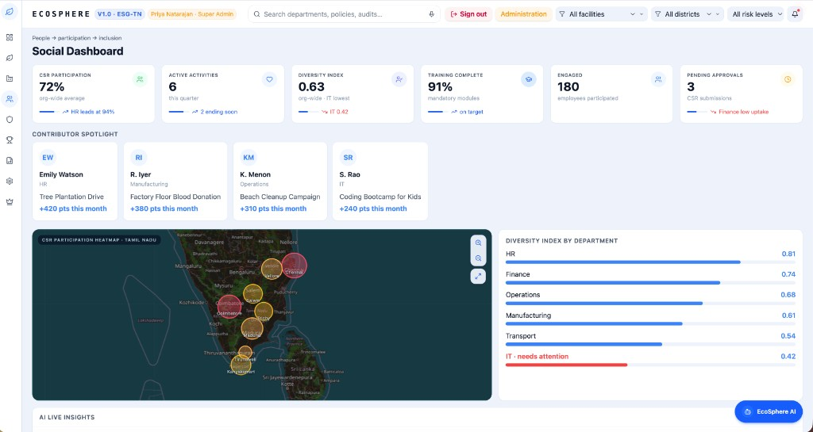
</p>
<p align="center"><em>Social — CSR participation heatmap, diversity by department</em></p>

<p align="center">
  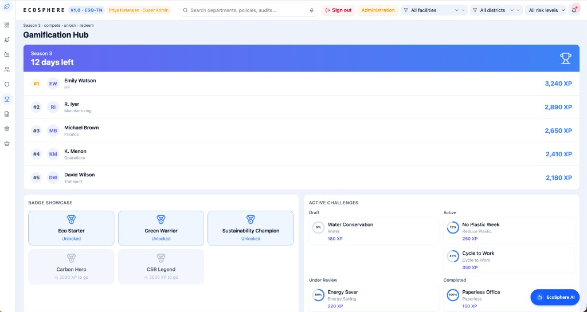
</p>
<p align="center"><em>Gamification — season leaderboard, badges, challenge kanban</em></p>

<p align="center">
  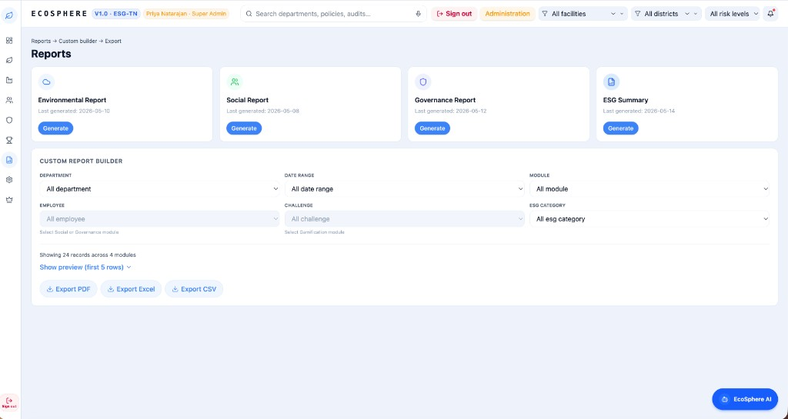
</p>
<p align="center"><em>Reports — typed reports + custom builder with live preview</em></p>

<p align="center">
  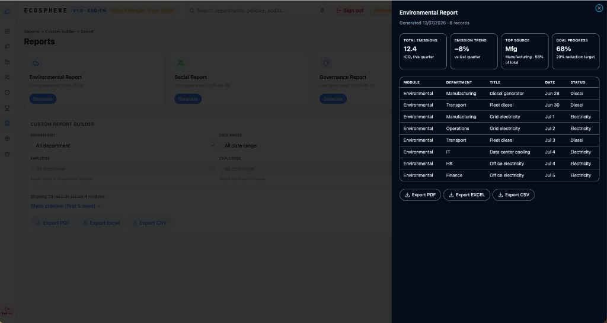
</p>
<p align="center"><em>Report preview — KPIs, data table, PDF/Excel/CSV export</em></p>

<p align="center">
  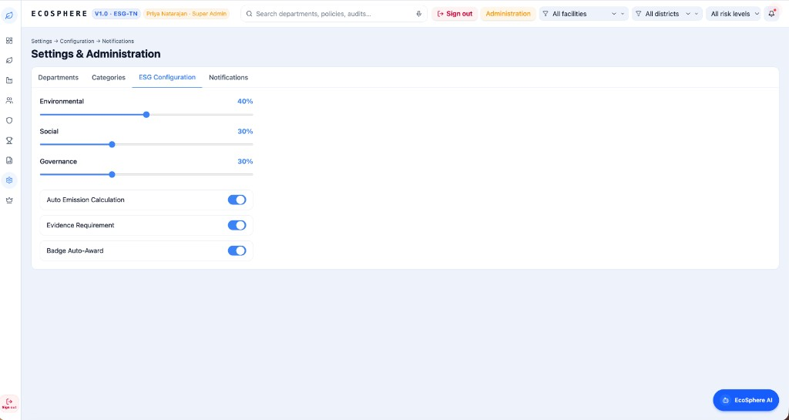
</p>
<p align="center"><em>Settings — ESG weights, emission rules, notifications</em></p>

<p align="center">
  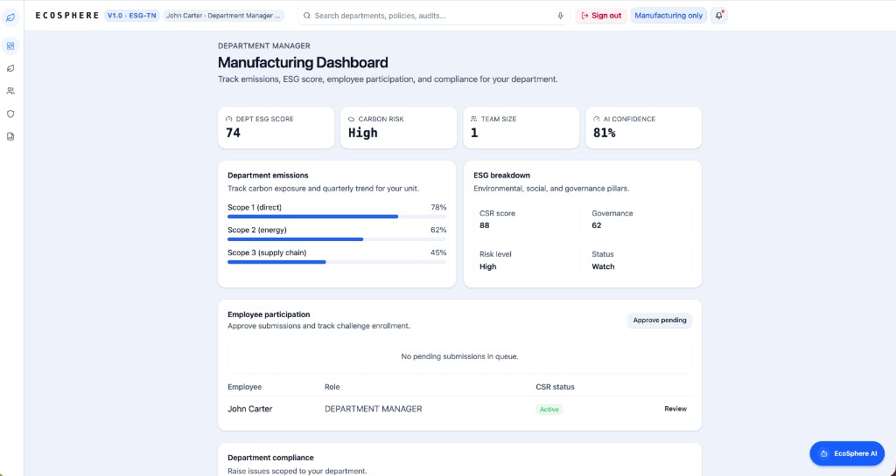
</p>
<p align="center"><em>Department Manager — scoped emissions, team CSR, AI confidence</em></p>

### Employee view (`/mobile`)

| Screen | What it shows |
|--------|----------------|
| **Home** | XP ring, rank, CSR map + weekly XP chart |
| **Challenges** | Joined challenges with progress bars |
| **Impact** | Personal kWh/CO₂ saved, **live digital twin**, impact charts |
| **Impact in words** | Plain-language narrative + **AI tips** for next actions |
| **Leaderboard** | Org top 5 + your position highlighted |

<p align="center">
  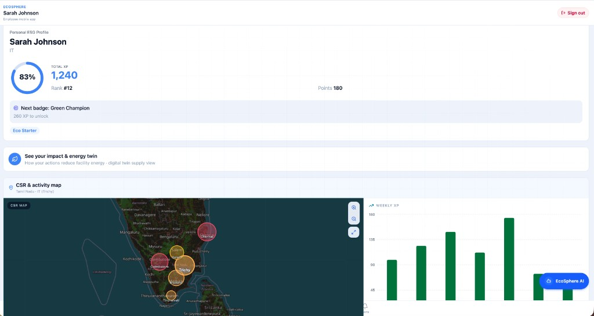
</p>
<p align="center"><em>Employee Home — XP, badges, CSR map, weekly XP chart</em></p>

<p align="center">
  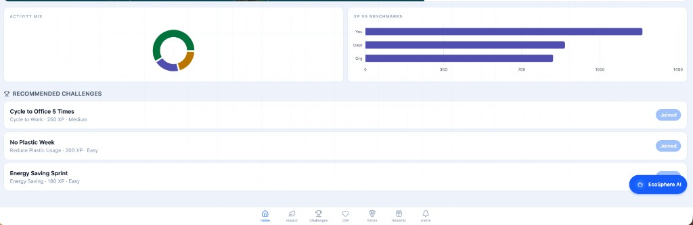
</p>
<p align="center"><em>Challenges — join, track progress, submit photo evidence</em></p>

<p align="center">
  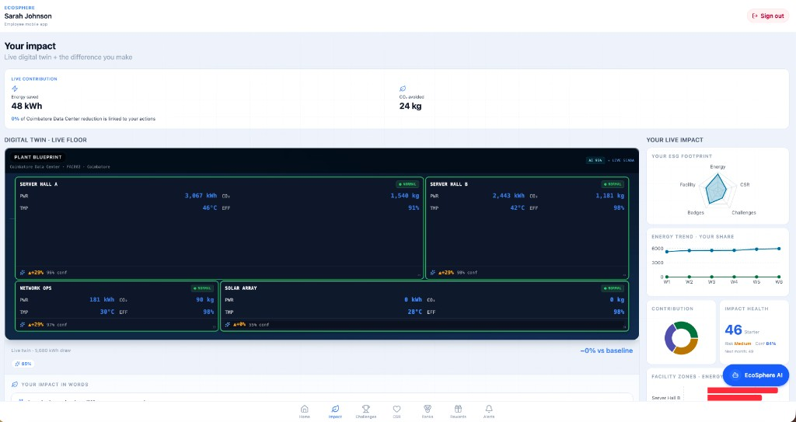
</p>
<p align="center"><em>Impact — personal savings + compact live digital twin</em></p>

<p align="center">
  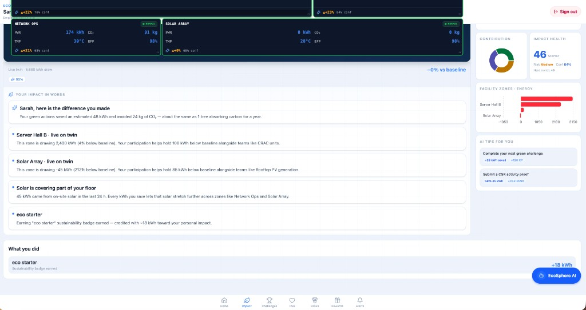
</p>
<p align="center"><em>Impact in words — narrative summary + AI tips for you</em></p>

<p align="center">
  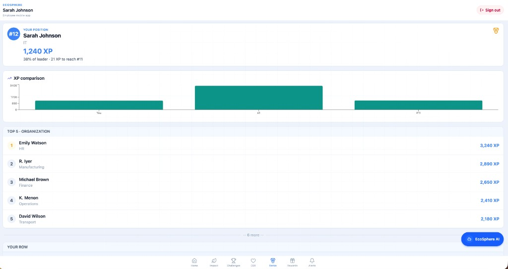
</p>
<p align="center"><em>Ranks — org leaderboard with your row highlighted</em></p>

---

## EcoSphere AI

**EcoSphere AI** is the intelligence layer across the product — not a bolt-on chat widget, but AI woven into how people explore and act on ESG data.

| Capability | Where you see it |
|------------|------------------|
| **AI chat assistant** | Floating **EcoSphere AI** button (solid blue) on every logged-in screen — web dashboards and employee view |
| **Role-aware prompts** | Suggested questions tailored to Super Admin, ESG Manager, Dept Manager, and Employee |
| **Confidence scoring** | AI confidence in the chat panel; facility-wide and per-zone scores on the digital twin |
| **ESG RAG search** | FastAPI `/api/rag/search` + Streamlit dashboard (:8501) to retrieve insight chunks from carbon, CSR, compliance, and challenge data |
| **Impact narratives** | Employees get plain-language “your impact in words” summaries linked to their contribution |

Open any role after login and tap **EcoSphere AI** — or hit the RAG dashboard at http://127.0.0.1:8501 when running `npm run dev:all`.

---

## Quick start

### Prerequisites

| Tool | Version |
|------|---------|
| Node.js | 18+ |
| npm | 9+ |
| Python | 3.10+ |

### Install everything

```bash
git clone https://github.com/Athina09/Odoo-Hackathon-.git
cd Odoo-Hackathon-
npm run install:all
```

This installs frontend dependencies and creates `backend/.venv` with FastAPI, Uvicorn, and Streamlit.

### Run full stack (recommended)

Starts **frontend** (:8090), **FastAPI API** (:8000), and **RAG dashboard** (:8501):

```bash
npm run dev:all
```

| Service | URL |
|---------|-----|
| EcoSphere web app | http://localhost:8090/ |
| Login | http://localhost:8090/login |
| **Employee view** | http://localhost:8090/mobile |
| API root | http://127.0.0.1:8000/ |
| API docs (Swagger) | http://127.0.0.1:8000/docs |
| **ESG RAG dashboard** | http://127.0.0.1:8501 |

Press `Ctrl+C` in the terminal to stop all services started by `dev:all`.

### Frontend only

```bash
npm run install:frontend
npm run dev
```

Works without Python — uses local mock data and `localStorage` for employee gamification.

### Backend only

```bash
npm run install:backend
cd backend
source .venv/bin/activate   # Windows: .venv\Scripts\activate
uvicorn main:app --host 127.0.0.1 --port 8000 --reload
```

### RAG dashboard only

```bash
cd backend
source .venv/bin/activate
streamlit run streamlit_rag_dashboard.py
```

Open http://127.0.0.1:8501 — search ESG insights, view pipeline stages, and retrieval metrics.

### Production build

```bash
npm run build
npm run preview
```

### npm scripts

| Script | Description |
|--------|-------------|
| `npm run dev` | Frontend dev server (port 8090) |
| `npm run dev:all` | Frontend + FastAPI + Streamlit RAG |
| `npm run install:all` | Frontend deps + Python venv |
| `npm run install:backend` | Create venv + `pip install -r requirements.txt` |
| `npm run install:frontend` | `npm install` in `frontend/` |
| `npm run build` | Production frontend build |
| `npm run lint` | ESLint |

---

## Login & passwords

Open **http://localhost:8090/login**

EcoSphere is for **leadership dashboards and the employee view**. Pick your role → select your account → enter the role password.

| Role | Name | Email | Password | Lands on |
|------|------|-------|----------|----------|
| **Super Admin** | Priya Natarajan | `superadmin@ecosphere.in` | `admin123` | `/` |
| **ESG Manager** | Alex Morgan | `alex.morgan@ecosphere.in` | `manager` | `/` |
| **Department Manager** | John Carter (Manufacturing) | `john.carter@ecosphere.in` | `dept123` | `/department` |
| **Department Manager** | Emily Watson (HR) | `emily.watson@ecosphere.in` | `dept123` | `/department` |
| **Department Manager** | Michael Brown (Finance) | `michael.brown@ecosphere.in` | `dept123` | `/department` |
| **Employee** | Sarah Johnson (IT) | `sarah.j@ecosphere.in` | `employee` | `/mobile` |
| **Employee** | David Wilson | `david.w@ecosphere.in` | `employee` | `/mobile` |

**Quick copy**

```
Super Admin:     superadmin@ecosphere.in / admin123
ESG Manager:     alex.morgan@ecosphere.in / manager
Dept Manager:    john.carter@ecosphere.in / dept123
Employee:        sarah.j@ecosphere.in / employee
```

| Role | Password |
|------|----------|
| Super Admin | `admin123` |
| ESG Manager | `manager` |
| Department Manager | `dept123` |
| Employee | `employee` |

**Sign out** is available in the top header (web roles) and the employee view header.

---

## What we built

### Web dashboards (role-gated)

| Route | Who | Highlights |
|-------|-----|------------|
| `/` | Super Admin, ESG Manager | KPI row, Tamil Nadu heatmap, AI live feed, department table, ESG charts |
| `/environment` | All web roles | Carbon transactions, emission factors, department carbon |
| `/social` | All web roles | CSR activities, participation heatmap |
| `/governance` | All web roles | Compliance kanban, policies, audits |
| `/gamification` | Super Admin, ESG Manager | Challenge kanban, leaderboard, badges |
| `/digital-twin` | Super Admin, ESG Manager | Live plant blueprint, zone telemetry, **AI confidence** KPI & per-zone scores |
| `/reports` | All web roles | Typed reports + **custom report builder** (PDF/Excel/CSV) |
| `/settings` | Super Admin | Org config, departments, notifications |
| `/admin` | Super Admin | Role assignments, people management |
| `/manager` | ESG Manager | Cross-department approvals |
| `/department` | Dept Manager | Scoped department dashboard |

### EcoSphere AI (all roles)

- Floating **EcoSphere AI** button (solid blue) on every logged-in screen
- Role-specific suggested prompts (executive, manager, employee)
- **AI confidence score** shown in the chat panel
- Employees see it above the bottom tab bar on the employee view

### Employee view (`/mobile`)

Designed for everyday employees — mobile-friendly layout in the browser (not a separate native app).

| Tab | Features |
|-----|----------|
| **Home** | XP ring, rank, badges, **CSR map + weekly XP chart** side-by-side, link to Impact |
| **Impact** | Personal kWh/CO₂ saved, **live digital twin floor**, impact charts (radar, energy trend, zones), **impact in words** narrative |
| **Challenges** | Join, progress bar, **camera photo evidence**, submit for approval |
| **CSR** | Browse activities, register, upload proof |
| **Ranks** | Full leaderboard with **your position** highlighted |
| **Rewards** | Points redemption catalog |
| **Alerts** | Approvals, badges, challenge updates |

Employee data bootstraps from **`GET /api/mobile/bootstrap/{employeeId}`** when the backend is running; falls back to `localStorage` offline.

**Try it:** `sarah.j@ecosphere.in` / `employee` → http://localhost:8090/mobile

### Reports

- **Typed reports** — Environmental, Social, Governance, ESG Summary: Generate → preview slide-over → export
- **Custom report builder** — filter by department, module, date range, employee, challenge, ESG category
- Field-aware filters (employee/challenge disabled unless module matches)
- Live preview table + export **PDF / Excel / CSV**

### Digital twin

- Live SCADA-style plant blueprint with zone widgets (energy, CO₂, temperature)
- Facility KPIs including **AI Model Confidence**
- Zone detail panel with per-zone confidence + AI insight
- Zone history table with **AI Conf.** column
- Employee Impact page shows a **compact live twin** linked to personal contribution

---

## FastAPI backend

Python backend mirroring frontend ESG mock data. Entry point: `backend/main.py`.

### Run manually

```bash
cd backend
python3 -m venv .venv
source .venv/bin/activate
pip install -r requirements.txt
uvicorn main:app --host 127.0.0.1 --port 8000 --reload
```

### API endpoints

| Method | Path | Description |
|--------|------|-------------|
| GET | `/` | API info + quick links |
| GET | `/api/health` | Health check + seed version |
| GET | `/api/esg/kpis` | Command Center KPIs |
| GET | `/api/esg/departments` | Department master data |
| GET | `/api/esg/emission-factors` | Emission factor catalog |
| GET | `/api/esg/carbon-transactions` | Carbon ledger (`?department=` optional) |
| GET | `/api/esg/csr-activities` | CSR activities |
| GET | `/api/esg/compliance-issues` | Governance compliance issues |
| GET | `/api/esg/challenges` | Gamification challenges |
| GET | `/api/esg/insights` | AI insight feed chunks |
| GET | `/api/mobile/employees` | Employee list |
| GET | `/api/mobile/bootstrap/{employeeId}` | Initialize employee session (XP, challenges, CSR, notifications) |
| GET | `/api/mobile/challenges/catalog` | Challenge catalog |
| GET | `/api/mobile/csr/catalog` | CSR catalog |
| GET | `/api/rag/search?query=` | ESG insight RAG search (`?module=` optional, `?n_results=`) |
| GET | `/api/rag/flow` | RAG pipeline stage definitions |
| GET | `/api/rag/metrics` | Retrieval evaluation metrics |

**Example**

```bash
curl "http://127.0.0.1:8000/api/health"
curl "http://127.0.0.1:8000/api/rag/search?query=manufacturing+carbon&module=Environmental"
curl "http://127.0.0.1:8000/api/mobile/bootstrap/emp-sarah"
```

Vite proxies `/api` → `http://127.0.0.1:8000` during `npm run dev` / `dev:all`.

### Backend files

| File | Purpose |
|------|---------|
| `main.py` | FastAPI app, CORS, router registration |
| `seed_data.py` | ESG, mobile, and RAG seed data |
| `routes/esg.py` | `/api/esg/*` |
| `routes/mobile.py` | `/api/mobile/*` |
| `routes/rag.py` | `/api/rag/*` |
| `rag_pipeline.py` | Chunk retrieval + pipeline stage metadata |
| `rag_metrics.py` | Precision/recall-style eval on seed queries |
| `streamlit_rag_dashboard.py` | Interactive RAG UI |
| `requirements.txt` | fastapi, uvicorn, streamlit, pandas |

---

## RAG pipeline

ESG insight retrieval over seeded ERP text chunks (carbon events, CSR, compliance, challenges).

### Pipeline stages

1. **Ingest** — load carbon, CSR, compliance, challenge records from `seed_data.py`
2. **Chunk** — one searchable document per insight with `module` + `department` metadata
3. **Retrieve** — keyword overlap scoring via `/api/rag/search`
4. **Evaluate** — precision metrics on held-out queries (`/api/rag/metrics`)
5. **Dashboard** — Streamlit UI for live search and pipeline status

Planned extensions (documented in `/api/rag/flow`): embeddings, reranking, LLM answer generation.

### How to use RAG

**Option A — Streamlit dashboard**

```bash
npm run dev:all          # starts everything including :8501
# or backend only:
cd backend && source .venv/bin/activate && streamlit run streamlit_rag_dashboard.py
```

Open http://127.0.0.1:8501 → enter a query → filter by module → see matched chunks.

**Option B — REST API**

```bash
curl "http://127.0.0.1:8000/api/rag/search?query=plastic+waste&n_results=5"
curl "http://127.0.0.1:8000/api/rag/flow"
curl "http://127.0.0.1:8000/api/rag/metrics"
```

**Option C — Swagger UI**

http://127.0.0.1:8000/docs → expand **rag** tag → try `/api/rag/search`.

---

## Tech stack

| Layer | Stack |
|-------|--------|
| **Frontend** | React 19, TypeScript, TanStack Router, Tailwind CSS, Framer Motion |
| **Charts** | Recharts |
| **Map** | Leaflet + OpenStreetMap (Tamil Nadu heatmap) |
| **UI** | Radix UI / shadcn-style primitives |
| **Backend** | FastAPI, Python 3.10+, Uvicorn |
| **RAG** | Keyword retrieval + Streamlit dashboard + eval metrics |
| **Export** | SheetJS (Excel), jsPDF (PDF), client-side CSV |
| **CI** | GitHub Actions — frontend lint/build + backend smoke tests |

---

## Project structure

```
Odoo-Hackathon-/
├── frontend/
│   ├── src/
│   │   ├── routes/                     # TanStack file routes
│   │   │   ├── index.tsx               # Command Center
│   │   │   ├── login.tsx
│   │   │   ├── digital-twin.tsx
│   │   │   ├── reports.tsx
│   │   │   └── mobile/                 # Employee view routes (home, impact, challenges, csr, …)
│   │   ├── components/ecosphere/
│   │   │   ├── screens/                # Page dashboards + DigitalTwinPage
│   │   │   ├── mobile/                 # EmployeeShell, challenges, CSR, impact, twin
│   │   │   ├── digital-twin/           # FloorPanel, LiveZoneWidget, zone detail
│   │   │   ├── ds/                     # KPI, heatmap, ConfidenceBar, AiConfidenceBadge
│   │   │   ├── EcoAiFab.tsx            # AI chatbot (all roles)
│   │   │   ├── CustomReportBuilder.tsx
│   │   │   └── ReportPreview.tsx
│   │   ├── lib/
│   │   │   ├── ecosphere-api.ts        # Backend API client
│   │   │   ├── report-builder.ts       # Custom reports + export
│   │   │   ├── employee-impact.ts      # Personal impact + twin linkage
│   │   │   ├── eco-ai-confidence.ts    # Role/zone AI confidence helpers
│   │   │   └── ecosphere-auth.ts       # Role-based login
│   │   ├── data/                       # Mock ESG + digital twin data
│   │   └── context/                    # Auth + employee gamification
│   └── package.json
├── backend/
│   ├── main.py
│   ├── seed_data.py
│   ├── rag_pipeline.py
│   ├── rag_metrics.py
│   ├── streamlit_rag_dashboard.py
│   ├── requirements.txt
│   └── routes/
│       ├── esg.py
│       ├── mobile.py
│       └── rag.py
├── scripts/
│   ├── dev-all.sh                      # Start frontend + API + RAG
│   └── init-backend.sh                 # Backend venv setup
├── .env.example
├── .github/workflows/ci.yml
└── package.json
```

Demo data: `frontend/src/data/` · Backend mirror: `backend/seed_data.py`

---

## Environment (optional)

```bash
cp .env.example .env
```

| Variable | Default | Description |
|----------|---------|-------------|
| `API_PORT` | `8000` | FastAPI port |
| `RAG_DASHBOARD_PORT` | `8501` | Streamlit RAG port |

---

## Business workflow

```
Master Configuration → Daily Operations → Carbon Transactions
  → Employee CSR & Challenges → E/S/G Scores → Org Dashboard & Reports
```

Weighted ESG: Environmental 40% / Social 30% / Governance 30% (configurable in settings).

---

## Core business rules

| Rule | Description |
|------|-------------|
| **Reward redemption** | Points/XP redeem for catalog rewards |
| **Notifications** | Compliance, CSR/challenge approvals, badge unlocks |
| **Auto emission calculation** | Carbon from Purchase/Manufacturing/Expense/Fleet via factors |
| **Evidence requirement** | CSR/challenges may require photo proof before approval |
| **Badge auto-award** | Badges when unlock rules are met |
| **Compliance ownership** | Issues have owner + due date; overdue flagged |

---

## Roadmap (Odoo ERP integration)

1. Sync master data from Odoo (departments, factors, policies, badges)
2. Ingest real ERP transactions into carbon ledger
3. Drive gamification from live employee actions
4. Replace keyword RAG with vector embeddings over ERP documents
5. Enforce business rules via Odoo settings

---

## License

Submitted for the **Odoo Hackathon** — [Athina09/Odoo-Hackathon-](https://github.com/Athina09/Odoo-Hackathon-).
